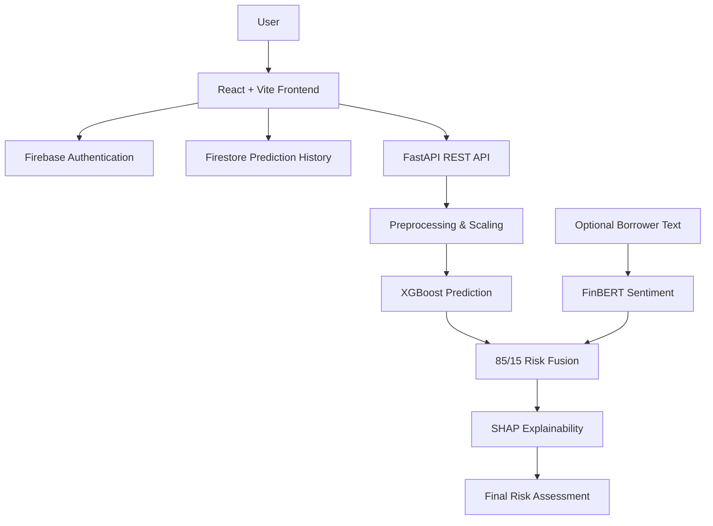

# Explainable AI Loan Default Risk Platform

An end-to-end full-stack machine learning application combining structured credit risk prediction, financial NLP, explainable AI, authentication, persistent prediction history, and report generation.

## Screenshots

- **Authentication:**
- 

- **Dashboard:** 
                 

- **Assessment Form & Result:** 

- **Prediction History:** 
                          
                          
## Key Features

- **Real XGBoost Prediction**: Uses checked-in trained model artifacts for default-probability inference.
- **Financial NLP via FinBERT**: Optional text analysis of the loan purpose using `ProsusAI/finbert`.
- **Intelligent Risk Fusion**: 85% structured ML / 15% NLP risk fusion (when text is present).
- **Explainable AI (SHAP)**: Per-assessment SHAP risk increasing and decreasing factors.
- **Authentication & Persistence**: Email/password authentication and user-isolated Firestore records.
- **Assessment History**: Filterable, sortable dashboard of past assessments with downloadable PDF reports.
- **Modern UI**: Built with React, Vite, Tailwind CSS, and Recharts.

## Architecture



## Technology Stack

**Frontend:**
- React, Vite, TypeScript
- Tailwind CSS (Vanilla), Recharts, Lucide-React
- Firebase SDK (Auth & Firestore)
- jsPDF

**Backend:**
- Python, FastAPI, Uvicorn
- XGBoost, Scikit-learn, Pandas, Numpy
- SHAP, Transformers (FinBERT)
- Pytest

## Machine Learning Pipeline
1. **Inputs:** Validates six structured features (`loan_amnt`, `int_rate`, `annual_inc`, `dti`, `open_acc`, `revol_util`).
2. **Preprocessing:** Applies a fitted `StandardScaler`.
3. **Structured Model:** `XGBClassifier` calculates default probability.
4. **NLP Model:** If text is provided, `FinBERT` outputs a risk signal based on sentiment.
5. **Fusion & Explanation:** Fuses scores (85% XGBoost, 15% FinBERT) and extracts feature contributions via `TreeExplainer`.

## Model Performance

The core structured model was trained on a public sample of the LendingClub dataset, achieving the following metrics on a 20% holdout test set (7,706 samples):

- **Accuracy:** 85.5%
- **ROC-AUC:** 0.687
- **F1 Score:** 0.026 (Note: Low due to significant class imbalance in the natural dataset, typical for naive default prediction without SMOTE or threshold tuning).

These metrics reflect realistic baseline performance on genuine financial data.

## Local Setup Instructions

### Prerequisites
- Node.js (v18+)
- Python 3.10+
- Firebase project with Authentication (Email/Password) and Firestore enabled.

### 1. Backend Setup

```powershell
cd backend
python -m venv venv
.\venv\Scripts\activate
pip install -r requirements.txt
python -m uvicorn app.main:app --reload --port 8000
```
Check `http://127.0.0.1:8000/api/health` to confirm the model service is ready.

### 2. Environment Variables (Frontend)
Create `frontend/.env` based on `frontend/.env.example`:
```env
VITE_API_URL=http://localhost:8000/api
VITE_FIREBASE_API_KEY=your_api_key
VITE_FIREBASE_AUTH_DOMAIN=your_project.firebaseapp.com
VITE_FIREBASE_PROJECT_ID=your_project_id
VITE_FIREBASE_STORAGE_BUCKET=your_bucket
VITE_FIREBASE_MESSAGING_SENDER_ID=your_sender_id
VITE_FIREBASE_APP_ID=your_app_id
```

### 3. Frontend Setup

```powershell
cd frontend
npm install
npm run dev
```

### 4. Firebase Setup
Publish `firestore.rules` (included in repo). Firebase may ask you to create a composite index when the history page first loads: `predictions (userId ascending, createdAt descending)`. Follow the link provided in the frontend console error if this occurs.

## GitHub Repository Initialization

To push this project to GitHub for the first time, follow these steps in your terminal at the root of the project (`loan-risk-app`):

```powershell
# 1. Initialize Git repository
git init

# 2. Add all files (respecting the .gitignore)
git add .

# 3. Create your initial commit
git commit -m "Initial commit: Loan Risk Platform"

# 4. Link to your GitHub repository (replace URL with your actual repo URL)
git remote add origin https://github.com/yourusername/LoanRisk-AI-Platform.git

# 5. Push your code to GitHub
git branch -M main
git push -u origin main
```

## Deployment Guide

### Frontend (Vercel)
1. Push your code to GitHub.
2. Go to [Vercel](https://vercel.com/) and create a **New Project**.
3. Import your `loan-risk-app` repository.
4. Set the **Framework Preset** to `Vite`.
5. Set the **Root Directory** to `frontend`.
6. Add all the Environment Variables from your `frontend/.env` file.
7. Click **Deploy**.

### Backend (Render or Fly.io via Docker)
Your backend contains a `Dockerfile` that packages the FastAPI app, XGBoost, and FinBERT into a production-ready container.

1. **Render**: 
   - Create a new **Web Service**.
   - Connect your GitHub repository.
   - Set the Root Directory to `backend`.
   - Render will automatically detect the `Dockerfile` and build the container.
   - Set the `CORS_ORIGINS` environment variable to your new Vercel frontend URL (e.g., `https://my-app.vercel.app`).
2. **Fly.io**: 
   - Install the `flyctl` CLI.
   - Navigate to the `backend` folder and run `fly launch`.
   - Fly will detect the Dockerfile and deploy it automatically.

### API Endpoints
- `GET /api/health`: Check model and FinBERT readiness.
- `POST /api/predict`: Validates data, runs XGBoost/FinBERT, fuses scores, and returns SHAP factors.


